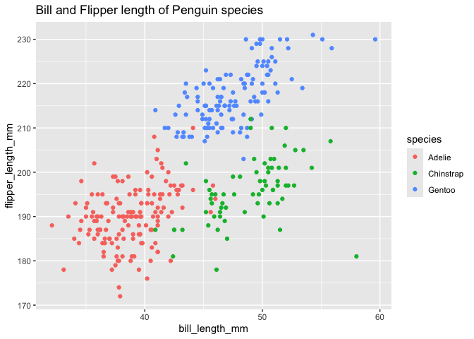

p8105_hw1_fp2513
================

## Loading penguins dataset

Here’s a **code chunk** to load the *penguins* data set:

``` r
data("penguins", package = "palmerpenguins")
```

## Describing the Penguins dataset

The next section writes a short description of the penguins data set.
This includes respectively, the column names, the number of rows, the
number of columns, and the mean flipper length in mm (and the code to
retrieve those results)

``` r
penguins_df = 

  print(colnames(penguins))
```

    ## [1] "species"           "island"            "bill_length_mm"   
    ## [4] "bill_depth_mm"     "flipper_length_mm" "body_mass_g"      
    ## [7] "sex"               "year"

``` r
  nrow(penguins) 
```

    ## [1] 344

``` r
  ncol(penguins) 
```

    ## [1] 8

``` r
  mean(penguins %>% 
         pull(flipper_length_mm), na.rm = TRUE)
```

    ## [1] 200.9152

The columns in the penguins data set include: species, island, bill
length (mm), bill depth (mm), flipper length (mm), body mass (g), sex,
and year. There are 344 rows and 8 columns. The mean flipper length of
these penguins in mm is 200.9152

# Section 3

Making a scatter plot of the flipper length (mm) (y-axis) against bill
length (mm) (x-axis); color indicates different species

``` r
ggplot(data = penguins) + 
  geom_point(mapping = aes(x = bill_length_mm, y = flipper_length_mm, 
                           color = species), na.rm = TRUE) +
ggtitle("Bill and Flipper length of Penguin species")
```

<!-- -->

``` r
ggsave("20240916 Penguins scatter plot.pdf")
```

## HW1 Problem 2

Creating a data frame comprised of: 1. A random sample of size 10 from a
standard Normal distribution 2. A logical vector indicating whether
elements of the sample are greater than 0 3. A character vector of
length 10 4. A factor vector of length 10, with 3 different factor
“levels”

``` r
set.seed(1234)

numeric_col <- rnorm(10, sd = 1)
logical_col <- as.logical(numeric_col > 0)
character_col <- sample(c(letters), 10, replace = FALSE)
factor_col <- as.factor(sample(c("Level1", "Level2", "Level3"), 10, replace = TRUE))

df <- data.frame(
  Numeric_Column = numeric_col,
  Logical_Column = logical_col,
  Character_Column = character_col,
  Factor_Column = factor_col
)

print(df)
```

    ##    Numeric_Column Logical_Column Character_Column Factor_Column
    ## 1      -1.2070657          FALSE                n        Level2
    ## 2       0.2774292           TRUE                x        Level2
    ## 3       1.0844412           TRUE                d        Level3
    ## 4      -2.3456977          FALSE                y        Level3
    ## 5       0.4291247           TRUE                u        Level3
    ## 6       0.5060559           TRUE                h        Level3
    ## 7      -0.5747400          FALSE                t        Level1
    ## 8      -0.5466319          FALSE                c        Level3
    ## 9      -0.5644520          FALSE                w        Level2
    ## 10     -0.8900378          FALSE                e        Level2

Take the mean of each variable in your dataframe. (Numeric and Logical
work, but Character and Factor do not)

``` r
mean(df %>% pull(Numeric_Column))
```

    ## [1] -0.3831574

``` r
mean(df %>% pull(Logical_Column))
```

    ## [1] 0.4

``` r
mean(df %>% pull(Character_Column))
```

    ## Warning in mean.default(df %>% pull(Character_Column)): argument is not numeric
    ## or logical: returning NA

    ## [1] NA

``` r
mean(df %>% pull(Factor_Column))
```

    ## Warning in mean.default(df %>% pull(Factor_Column)): argument is not numeric or
    ## logical: returning NA

    ## [1] NA

Write a code chunk that applies the as.numeric function to the logical,
character, and factor variables (please show this chunk but not the
output)

``` r
as.numeric(df %>% pull(Logical_Column))
as.numeric(df %>% pull(Character_Column))
as.numeric(df %>% pull(Factor_Column))
```

What happens, and why? Does this help explain what happens when you try
to take the mean?

Converting the logical column into a numeric turns the TRUE FALSE into
binary 1 and 0 respectively

Converting the character values into numeric, but since characters are
not numeric, the output is NA for each character value

Converting the factor values maps each level of the factor into an
integer code (here 3 levels so either 1, 2 or 3)
